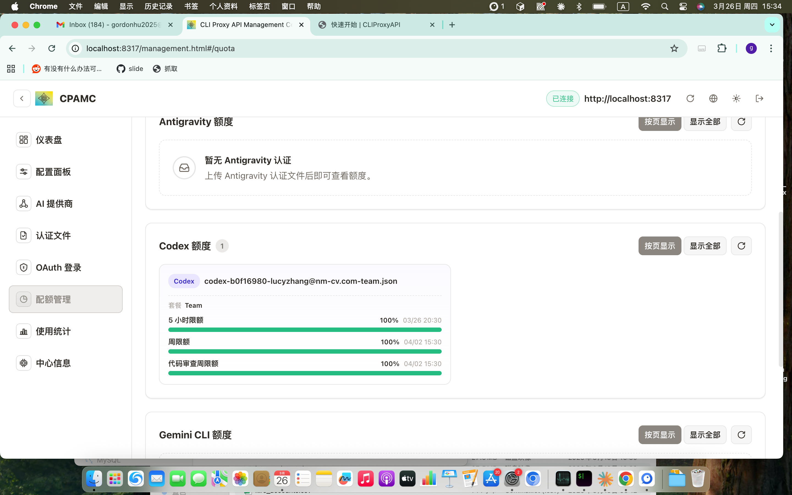
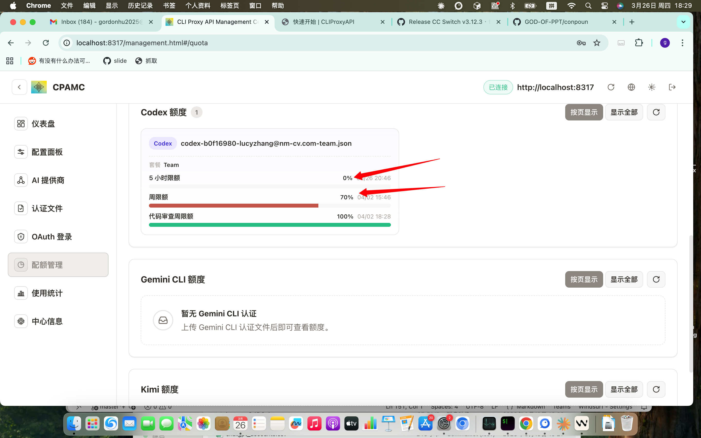

# GPT Codex Team 采购席位调研报告

**调研日期：** 2026年3月26日
**调研对象：** 45人开发团队
**核心问题：** 采购 GPT Codex Team 席位数量及方案选择
**数据来源：** OpenAI 官方定价、Codex Rate Card、GitHub Discussions #2251、OpenRouter 实时抓取、内部实测

---

## 一、结论摘要

> 快速结论，供决策参考。详细分析见各章节。

**推荐方案：ChatGPT Business 45席 + 分层使用策略，月度总成本约 $2,000**

| 组成 | 月费 | 说明 |
|------|------|------|
| Business 45席 | $1,350 | 覆盖全团队，含 SSO、数据安全、云端任务 |
| Credits 超额预算 | ~$450 | $10/人，应对重度用户超额 |
| API Key（CI/CD）| ~$200 | 自动化任务按量计费，不占订阅限额 |
| **合计** | **~$2,000/月** | **约 ¥14,500/月** |

**三条关键结论：**
1. Business 方案限额对中等强度用户够用，重度用户需配合 credits 补充
2. 官方订阅比纯 API 调用主力模型便宜 2.2 倍，且含云端任务和代码审查
3. 日常任务优先用 GPT-5.4-mini（成本降 3.5 倍），复杂任务用 GPT-5.3-Codex

---

## 二、方案与定价概览

### 2.1 订阅方案对比

| 方案 | 价格 | 使用限额 | 团队功能 | 适用场景 |
|------|------|---------|---------|----------|
| ChatGPT Plus | $20/人/月 | 基础 | 无 | 个人轻度使用 |
| ChatGPT Pro | $200/人/月 | 6–7x Business | 无（个人账号）| 全职重度依赖个人 |
| **ChatGPT Business** | **$30/人/月** | **与 Plus 相同** | **SSO/MFA/共享 credits** | **推荐：团队中等强度** |
| ChatGPT Enterprise | 联系销售 | 无固定限额 | 全套企业功能 | 大规模/合规优先 |
| API Key 模式 | 按用量计费 | 无限额 | 无 | CI/CD 自动化 |

> **当前优惠：** Plus/Pro/Business/Enterprise 订阅者享受 **2倍 Codex 使用限额**（限时）。

### 2.2 各方案使用限额（每5小时窗口）

**本地消息限额：**

| 方案 | GPT-5.4 | GPT-5.4-mini | GPT-5.3-Codex |
|------|---------|-------------|---------------|
| Plus / Business | 33–168 条 | 110–560 条 | 45–225 条 |
| Pro | 223–1120 条 | 743–3733 条 | 300–1500 条 |
| Enterprise | 无固定上限，按 credits 计费 | | |

**云端任务 & 代码审查（仅 GPT-5.3-Codex 支持）：**

| 方案 | 云端任务 / 5小时 | 代码审查 / 周 |
|------|----------------|---------------|
| Plus / Business | 10–60 个 | 10–25 个 |
| Pro | 50–400 个 | 100–250 个 |

> **说明：** 本地消息与云端任务共享同一5小时窗口；另有独立的**周限额**约束。Business 与 Plus 限额相同，差异在团队管理功能。

### 2.3 Credit 消耗速率（订阅方案）

| 任务类型 | GPT-5.4 | GPT-5.4-mini | GPT-5.3-Codex |
|---------|---------|-------------|---------------|
| 本地任务（1条消息）| ~7 credits | ~2 credits | ~5 credits |
| 云端任务（1条消息）| 不可用 | 不可用 | ~25 credits |
| 代码审查（1个PR）| 不可用 | 不可用 | ~25 credits |
| Fast Mode 加成 | **2x**（仅 GPT-5.4）| 不支持 | 不支持 |

---

## 三、模型能力与 API 定价对比

### 3.1 OpenAI 模型横向对比

| 对比维度 | GPT-5.4 Pro | GPT-5.4 | GPT-5.3-Codex | GPT-5.4-mini |
|---------|------------|---------|--------------|-------------|
| **API 输入价格 /1M** | $30（≤272K）| $2.50（≤272K）| $1.75 | $0.75 |
| **API 输出价格 /1M** | $180（≤272K）| $15.00 | $14.00 | $4.50 |
| **上下文窗口** | 1.05M | 1.05M | 400K | 400K |
| **延迟** | ~139s | ~1.89s | ~9.56s | ~0.58s |
| **吞吐量** | 7 tok/s | 45 tok/s | 23 tok/s | 70 tok/s |
| **Codex 订阅支持** | 否 | 是 | 是 | 是 |
| **云端任务/代码审查** | 否 | 否 | **是** | 否 |
| **reasoning.effort** | 内置最强 | none~xhigh | none~xhigh | 有限 |
| **每人每月 API 成本** | ~极高 | ~$76 | ~$66 | ~$24 |
| **日常编码推荐度** | 不推荐 | 推荐 | **强烈推荐** | **首选** |

### 3.2 Claude 模型对比（仅 API 模式）

| 对比维度 | Claude Sonnet 4.6 | Claude Opus 4.6 | GPT-5.3-Codex（参考）|
|---------|-----------------|----------------|--------------------|
| **API 输入价格 /1M** | $3.00 | $5.00 | $1.75 |
| **API 输出价格 /1M** | $15.00 | $25.00 | $14.00 |
| **Cache 读取 /1M** | $0.30 | $0.50 | $0.175 |
| **Cache 写入 /1M** | $3.75 | $6.25 | 无 |
| **上下文窗口** | 1M | 1M | 400K |
| **延迟（最优）** | 1.26s (GCP) | 1.76s (GCP) | 9.56s |
| **提供商数量** | 5家 | 4家 | 2家 |
| **零数据保留** | 有 | 有 | 有（Azure）|
| **Codex 订阅支持** | **否** | **否** | 是 |
| **每人每月 API 成本** | ~$78 | ~$130 | ~$66 |

**Claude 注意事项：** 仅 API 模式，不含 Codex 云端任务和代码审查；如需混用 GPT+Claude，建议通过 OpenRouter 统一管理。

---

## 四、采购方案建议

### 4.1 三种方案对比

| 方案 | 席位构成 | 月费 | 年费 | 适合情况 |
|------|---------|------|------|----------|
| **全员 Business**（推荐）| 45席 | $1,350 | $16,200 | 中等强度，有团队管理需求 |
| **分级采购** | 5 Pro + 40 Business | $2,200 | $26,400 | 有核心重度用户 |
| 全员 Pro | 45席 | $9,000 | $108,000 | 全员全职重度（性价比低）|
| Enterprise | 联系销售 | — | — | 合规优先，弹性计费 |

### 4.2 推荐：全员 Business + 分层使用策略

| 组成 | 月费 | 说明 |
|------|------|------|
| Business 45席 | $1,350 | 含 SSO、共享 credits 池、云端任务 |
| Credits 超额预算 | ~$450 | $10/人，覆盖重度用户超额 |
| API Key（CI/CD）| ~$200 | 自动化任务按量，不占订阅限额 |
| **合计** | **~$2,000/月** | **约 ¥14,500/月** |

**推荐理由：**
1. GPT-5.3-Codex 中等强度，订阅比纯 API 便宜 2.2 倍，且含云端任务和代码审查
2. SAML SSO、MFA、专属工作区、数据不用于训练
3. Credits 共享池灵活应对超额，初期先购 Business 试用 1–2 个月再评估

### 4.3 不推荐的方案

| 方案 | 不推荐原因 |
|------|----------|
| 全员 Pro | $9,000/月，是 Business 的 6.7 倍，但重度用户同样约 2 天触发周限额 |
| 纯 API 模式 | GPT-5.3-Codex 约 $66/人/月，无团队管理，无云端任务和代码审查 |
| GPT-5.4 Pro API | $30/1M 输入，延迟 139s，不适合日常编码 |

---

## 五、使用限额风险评估

### 5.1 限额充分性分析

| 用户强度 | 5小时窗口体验 | 周限额体验 |
|---------|------------|----------|
| 轻度（≤4h/天）| 基本够用 | 不会触发 |
| 中等（4–6h/天）| 偶尔触发，等约30分钟 | 约4–5天触发 |
| 重度（≥6h/天）| 约2小时达上限 | **约1–2天耗尽** |

### 5.2 内部实测数据

> 来源：内部测试（`docs/team_5_hours_usage_case.md`）

- **账号：** 全新 ChatGPT Business（Team）账号
- **模型：** GPT-5.4 + GPT-5.3-Codex
- **工具：** OpenCode、Oh-My-OpenCode
- **结论：** 全新账号在 **5小时内即用尽限额**，5小时窗口与周限额双重约束

| 截图说明 | 图片 |
|---------|------|
| 全新账号初始额度 |  |
| 周额度剩余 |  |
| 5小时限额用尽 |  |
| Token 使用详情 |  |

### 5.3 应对策略

1. **切换 GPT-5.4-mini**：成本降 3.5 倍，限额延长 3.3 倍（无额外费用）
2. **购买 workspace credits**：$10/1000 credits，团队共享池，立即续期
3. **CI/CD 走 API Key**：不占订阅限额，按量计费
4. **控制推理深度**：日常默认 `medium`，避免 `xhigh` 过快消耗
5. **精简上下文**：压缩 AGENTS.md，关闭不需要的 MCP 服务器

---

## 六、常见问题解答

### Q1：45席 Business 够用吗？不够用怎么办？

**中等强度够用，重度用户需配合 credits 补充。**

- 够用条件：每天编码 ≤4h，日常用 GPT-5.4-mini，CI/CD 走 API Key
- 不够用时按优先级：切换 mini → 购买 credits → 超额用 API Key → 核心成员升 Pro

### Q2：API调用层面官方价格比 OpenRouter 便宜吗？

**价格完全相同；OpenRouter 还额外提供零数据保留选项。**

| 渠道 | GPT-5.4 /1M | GPT-5.3-Codex /1M | 数据保留 |
|------|------------|-----------------|--------|
| OpenAI 官方 | $2.50 | $1.75 | 保留（未知时长）|
| OpenRouter → OpenAI | $2.50 | $1.75 | 保留（未知时长）|
| OpenRouter → Azure | $2.50 | $1.75 | **Zero retention** |

OpenRouter 额外优势：缓存命中优化（GPT-5.4-mini 实际均价降 67%）、多提供商自动路由、OpenAI+Anthropic 统一账单。

### Q3：xhigh 思维链比默认贵多少？

**估算 xhigh 比默认 medium 贵约 5–15 倍。**

| 推理深度 | 参数 | 估算单次费用（API）| 相对倍数 |
|---------|------|-----------------|--------|
| 无推理 | `none` | ~$0.01 | 1x |
| 默认 | `medium` | ~$0.08–0.23 | 8–23x |
| 高 | `high` | ~$0.30–0.75 | 30–75x |
| 极高 | `xhigh` | ~$0.75–3.00 | 75–300x |

社区实测：xhigh 解决疑难 bug 消耗 $4.14，耗时45分钟。建议日常默认 `medium`，疑难 bug 才启用 `xhigh`，且优先走 API Key 模式。

### Q4：官方 Team 席位 vs OpenRouter API，哪个更划算？

**按使用强度选择，主力开发任务官方订阅更划算。**

| 使用场景 | 官方 Business | OpenRouter API | 建议 |
|---------|--------------|---------------|------|
| 轻度（50条/天，mini 为主）| $1,350/月（固定）| ~$540/月 | **OpenRouter 省 60%** |
| 中等（100条/天，Codex 为主）| $1,350/月 | ~$2,970/月 | **官方便宜 2.2x，且含云端任务** |
| 重度（200条/天，频繁超额）| ~$2,000/月（含 credits）| ~$5,940/月 | **官方便宜 3x** |
| 混合 GPT + Claude | $1,350 + Claude API 另算 | 按量，统一账单 | **OpenRouter 更灵活** |

**综合建议：** 主力任务用官方 Business，CI/CD 和轻度任务用 OpenRouter API，两者结合月度成本约 $1,550–2,000。

## 附录一：OpenRouter 多提供商 API 定价详情

> 详细数据（延迟、吞吐量、可用率、数据保留）见：**[openrouter-pricing.md](./openrouter-pricing.md)**

---

## 附录二：参考资料

1. [Codex 官方定价页](https://developers.openai.com/codex/pricing)
2. [Codex Rate Card](https://help.openai.com/en/articles/20001106-codex-rate-card)
3. [GitHub Discussions #2251 - 使用限额社区讨论](https://github.com/openai/codex/discussions/2251)
4. [ChatGPT Plus/Pro Credits 说明](https://help.openai.com/en/articles/12642688-using-credits-for-flexible-usage-in-chatgpt-freegopluspro-sora)
5. [Business/Enterprise 弹性定价说明](https://help.openai.com/en/articles/11487671-flexible-pricing-for-the-enterprise-edu-and-business-plans)
